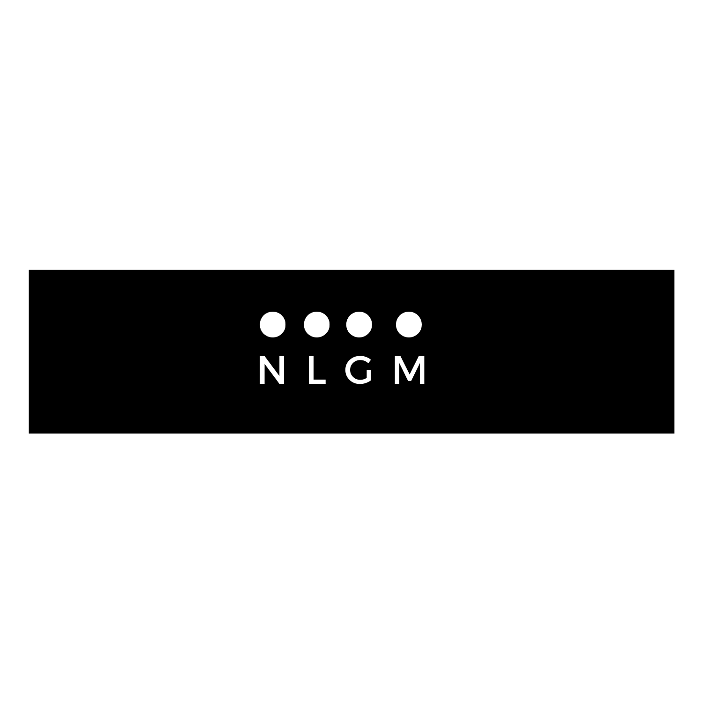

<h3 align="center">
    
</h3>

--------------------------------------------------------------------------------

> [!WARNING]
> This package is still in its early stages. Updates may cause breaking changes.

Neural Geometry is a Python package inspired by the approach taken in [Neural Latent Geometry Search: Product Manifold Inference via Gromov-Hausdorff-Informed Bayesian Optimization](https://arxiv.org/pdf/2309.04810.pdf).

The main high-level features include:
- Implementation of the neural latent geometry search framework, a novel approach to infer product manifolds by leveraging Gromov-Hausdorff distances.
- Various optimization methods to suit different requirements.

This package is compatible with libraries like NumPy and PyTorch. For documentation, see [docs](https://ae-bii.github.io/neural-geometry/).

## Installation

To install Neural Geometry, you can use pip:

```bash
pip install neural-geometry
```

You can install optional packages for development or visualization using:

```bash
pip install .[dev,vis]                # install from pyproject.toml
pip install neural-geometry[dev,vis]  # install from pypi
```

## Usage

After installing, you can import the package and use it by following the [example](examples/example.py).

## Contributing

Contributions to Neural Geometry are welcome! To contribute:

1. Fork the repository.
2. Install the pre-commit hooks using `pre-commit install`.
3. Create a new branch for your changes.
4. Make your changes in your branch.
5. Submit a pull request.

Before submitting your pull request, please make sure your changes pass all tests.

## License

Neural Geometry is licensed under the MIT License. See the [LICENSE](LICENSE) file for more details.
